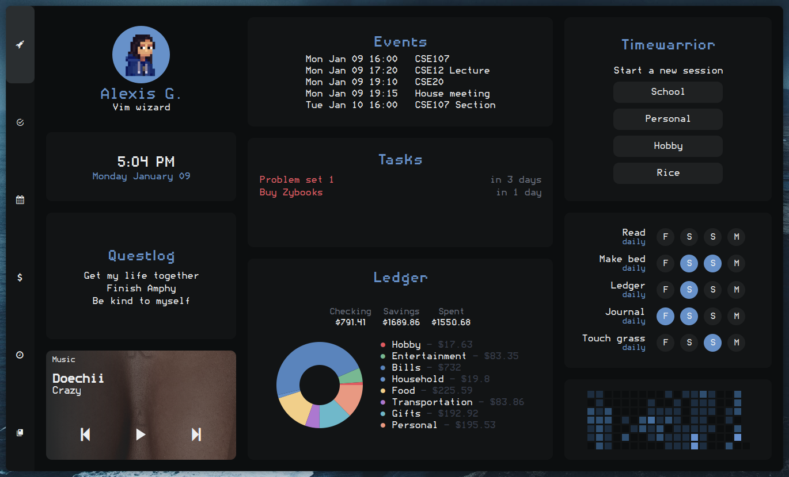

```
░█▀▄░█▀▀░█▀█░█▀▄░█▄█░█▀▀
░█▀▄░█▀▀░█▀█░█░█░█░█░█▀▀
░▀░▀░▀▀▀░▀░▀░▀▀░░▀░▀░▀▀▀
```

# ⌨️ Keyboard navigation for AwesomeWM widgets

This library provides support for keyboard navigation within widgets. I hope fellow Vim enthusiasts find it useful.  

Documentation is a little sparse right now but I'll update when I can and as best as I can.

The code is not very clean at the moment (which is why it has not been posted anywhere) but the library works perfectly for my needs.

# Usage
UI elements that you can interact with are called navitems
  - You need to define a class for every navitem that you want
  - This class includes `release`, `select_on`, and `select_off` functions that determine how the navitem should behave when interacting with it

Navitems are grouped into areas

The navigator controls moving through areas

Every widget has a root area
  - You don't interact with the root area; it just acts as a container for other areas
  - Other areas must be appended to root (`nav_root:append(your_area_name)`)

```
-- Initializing the navigator
local navigator = require("modules.keynav").navigator
local navigator, nav_root = navigator()
```

To start/stop the navigator, call `navigator:start()` and `navigator:stop()`
  - This usually goes within a widget opened/closed signal

```
awesome.connect_signal("dash::open", function()
  dash.visible = true
  navigator:start()
end)

awesome.connect_signal("dash::close", function()
  dash.visible = false
  navigator:stop()
end)
```

# Examples
## Dashboard: main tab


The underlying keynav structure here looks like this
```
┌────────────────────────────────────────────────────┐
│                     NAV_ROOT                       │
│                                                    │
│ ┌────────────────────┐   ┌───────────────────────┐ │
│ │  NAV_TIMEWARRIOR   │   │      NAV_HABITS       │ │
│ │                    │   │ ┌───────────────────┐ │ │
│ │   - stop button    │   │ │     EXERCISE      │ │ │
│ └────────────────────┘   │ │- saturday button  │ │ │
│                          │ │- sunday button    │ │ │
│                          │ │- monday button    │ │ │
│                          │ │- tuesday button   │ │ │
│                          │ └───────────────────┘ │ │
│                          │ ┌───────────────────┐ │ │
│                          │ │       READ        │ │ │
│                          │ │- saturday button  │ │ │
│                          │ │- sunday button    │ │ │
│                          │ │- monday button    │ │ │
│                          │ │- tuesday button   │ │ │
│                          │ └───────────────────┘ │ │
│                          │  and so on for the    │ │
│                          │     other habits      │ │
│                          └───────────────────────┘ │
└────────────────────────────────────────────────────┘
```
- Pressing hjkl moves between navitems in an area
- Pressing enter "clicks" the button
- Pressing (shift+)tab cycles between areas

- Navitems in an area can be laid out in a grid (see habit widget)

To replicate this, just set a few flags when initializing the area:

```
local nav_dash_habits = area({
  name    = "nav_dash_habits",
  is_grid = true,
  grid_rows = 5,
  grid_cols = 4,
})
```

## Task manager
The underlying keynav structure here looks like this
```
┌─────────────────────────────────────────────────────────────┐
│                        NAV_ROOT                             │
│    ┌────────────┐  ┌─────────────────┐   ┌───────────────┐  │
│    │  NAV_TAGS  │  │   NAV_PROJECTS  │   │ NAV_TASKLIST  │  │
│    │  - tag 1   │  │  - project 1    │   │  - task 1     │  │
│    │  - tag 2   │  │  - project 2    │   │  - task 2     │  │
│    │  - tag 3   │  │  - etc          │   │  - etc        │  │
│    │  - etc     │  │                 │   │               │  │
│    └────────────┘  └─────────────────┘   └───────────────┘  │
└─────────────────────────────────────────────────────────────┘
```

- Areas can have "container" widgets attached to them
  - These widgets only have the `select_on` and `select_off` functions defined
  - Example: the tags, projects, and tasklist areas have wibox.container.background set as the container widget
    - When entering the area, the container widget highlights
    - When leaving the area, the container widget unhighlights
  
- Pressing G/gg jumps to top/bottom

## Control center
The underlying keynav structure here looks like this
```
┌──────────────────────────────────────────────────────────────────────┐
│                             NAV_ROOT                                 │
│                                                                      │
│  ┌────────────────┐  ┌────────────────────┐   ┌────────────────────┐ │
│  │ NAV_ANIMATIONS │  │ NAV_QUICK_ACTIONS  │   │     NAV_POWER      │ │
│  │    - fast      │  │ - quick action 1   │   │  - power option 1  │ │
│  │    - fancy     │  │ - quick action 2   │   │  - power option 2  │ │
│  │    - off       │  │ - etc              │   └────────────────────┘ │
│  └────────────────┘  └────────────────────┘   ┌────────────────────┐ │
│                                               │ NAV_POWER_CONFIRM  │ │
│                                               │       - yes        │ │
│                                               │       - no         │ │
│                                               └────────────────────┘ │
└──────────────────────────────────────────────────────────────────────┘
```
(todo)

## Theme switcher
(todo)

# Debugging
- Use Xephyr to test your config in a sandbox
- Open whatever widget you're testing, then press `q` to print the keynav hierarchy

